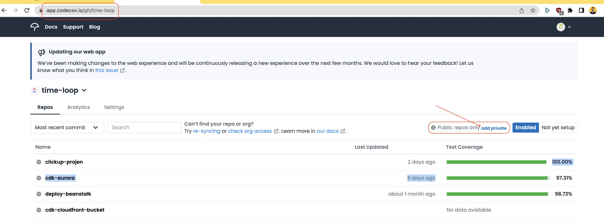
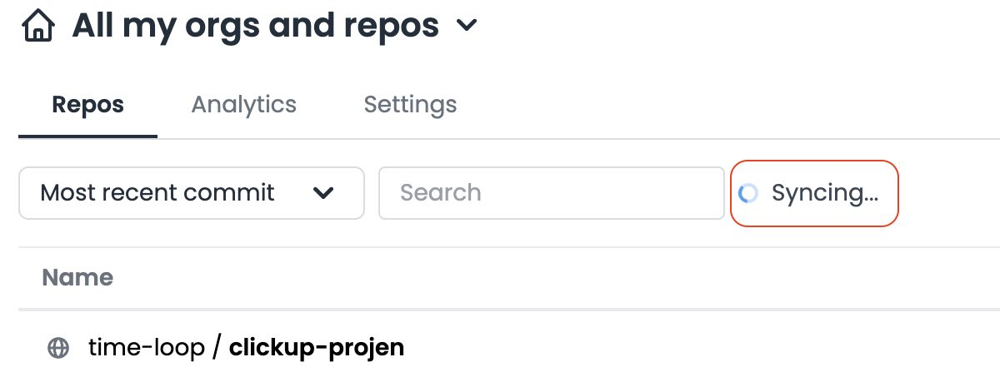
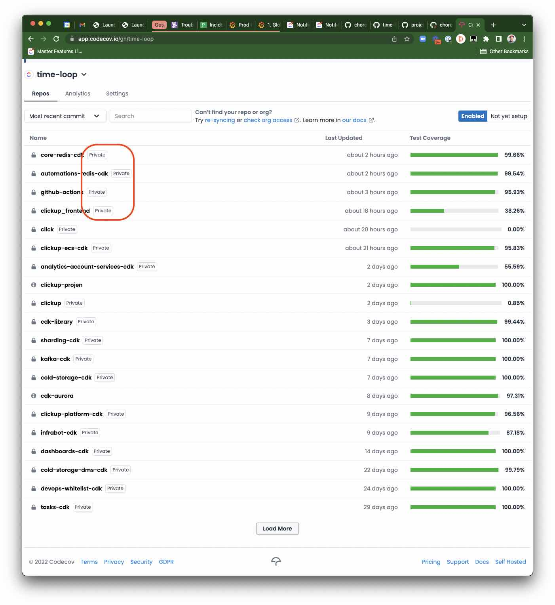

# CodeCov Private Repo Access

CodeCov defaults to only requesting access to public repos
when you connect up with your github account.
This document show how to enable the "private scope"
so you can see private repos.

## Starting Point

Start by logging into CodeCov. The first time you log in,
you will need to authenticate with your GitHub account.
Eventually you should end up at a screen that looks like this:

[codecov.io/gh/time-loop](https://codecov.io/gh/time-loop)

You need to click on the `add private` link,
and then go through what looks like a repeat of the
github auth process, except it will say "Codecov is requesting additional permissions". Click your way through. Once you're done, you will see a `syncing` icon:

In a few moments, you should see all the private repos appear.

