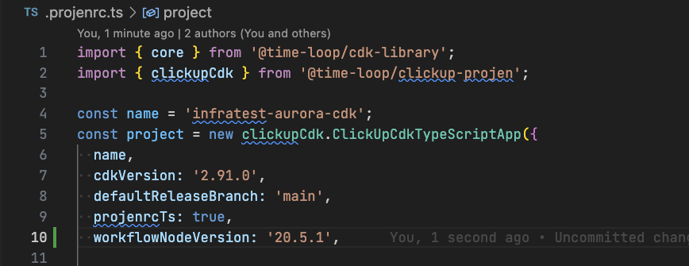

# Node Upgrade

How to upgrade your node to a version greater than the default.
Default is in `/src/utils/parameters.ts PROJEN_NODE_VERSION`.

## WARNING

You could use this to downgrade your node version.
There are no checks in place to prevent this.
Do so at your own risk and make sure you know what you are doing.

## Steps

1. Update your `.projenrc.ts` with `workflowNodeVersion: '20.5.1'` or whatever version of node you want to use.

1. Run `npx projen`, `git add .`, and `git commit -m "feat: upgrade node to v20.5.1"` as appropriate. Push and merge.

## Troubleshooting

Make sure you are running at least [v0.0.168](https://github.com/time-loop/clickup-projen/releases/tag/v0.0.168) of this library.
To upgrade this library (as well as core `projen`), use the `update-projen-main` workflow: 

The `.nvmrc` decides which version of node is used by your `cdkPipeline`. The `.github/workflows` are managed directly by projen so it's pretty easy to see when they've been upgraded.
